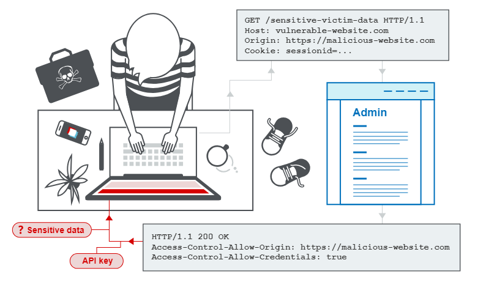

### Cross-origin resource sharing (CORS)

# What is CORS (cross-origin resource sharing)?

- Chia sẻ tài nguyên nhiều nguồn gốc (CORS) là một cơ chế trình duyệt cho phép truy cập có kiểm soát vào các tài nguyên nằm bên ngoài một miền nhất định. Nó mở rộng và bổ sung tính linh hoạt cho chính sách cùng nguồn gốc ( SOP ). Tuy nhiên, nó cũng tiềm ẩn nguy cơ xảy ra các cuộc tấn công giữa các miền nếu chính sách CORS của trang web được định cấu hình và triển khai kém. CORS không phải là biện pháp bảo vệ chống lại các cuộc tấn công có nguồn gốc chéo như giả mạo yêu cầu giữa các trang ( CSR ).

Flow:

# Chính sách cùng nguồn gốc
- Chính sách cùng nguồn gốc là một đặc tả hạn chế về nhiều nguồn gốc nhằm giới hạn khả năng trang web tương tác với các tài nguyên bên ngoài miền nguồn. Chính sách cùng nguồn gốc đã được xác định từ nhiều năm trước để ứng phó với các tương tác giữa các miền độc hại tiềm ẩn, chẳng hạn như một trang web đánh cắp dữ liệu riêng tư từ một trang web khác. Nó thường cho phép một miền đưa ra yêu cầu cho các miền khác nhưng không truy cập được các phản hồi.

# Nới lỏng chính sách cùng nguồn gốc
- Chính sách cùng nguồn gốc rất hạn chế và do đó nhiều cách tiếp cận khác nhau đã được đưa ra để tránh những hạn chế đó. Nhiều trang web tương tác với tên miền phụ hoặc trang web của bên thứ ba theo cách yêu cầu quyền truy cập đầy đủ từ nhiều nguồn gốc. Có thể nới lỏng có kiểm soát chính sách cùng nguồn gốc bằng cách sử dụng chia sẻ tài nguyên nhiều nguồn gốc (CORS).

- Giao thức chia sẻ tài nguyên nhiều nguồn gốc sử dụng một bộ tiêu đề HTTP xác định nguồn gốc web đáng tin cậy và các thuộc tính liên quan, chẳng hạn như liệu quyền truy cập được xác thực có được phép hay không. Chúng được kết hợp trong một trao đổi tiêu đề giữa trình duyệt và trang web có nguồn gốc chéo mà nó đang cố truy cập.

# Lỗ hổng phát sinh từ các vấn đề cấu hình CORS
- Nhiều trang web hiện đại sử dụng CORS để cho phép truy cập từ tên miền phụ và bên thứ ba đáng tin cậy. Việc triển khai CORS của họ có thể có sai sót hoặc quá nhẹ nhàng để đảm bảo rằng mọi thứ đều hoạt động và điều này có thể dẫn đến các lỗ hổng có thể bị khai thác.

# Cách ngăn chặn các cuộc tấn công dựa trên CORS
- Lỗ hổng CORS phát sinh chủ yếu do cấu hình sai. Do đó, việc phòng ngừa là một vấn đề về cấu hình. Các phần sau đây mô tả một số biện pháp phòng vệ hiệu quả chống lại các cuộc tấn công CORS.

- Cấu hình thích hợp của các yêu cầu có nguồn gốc chéo
Nếu tài nguyên web chứa thông tin nhạy cảm thì nguồn gốc phải được chỉ định chính xác trong Access-Control-Allow-Origintiêu đề.

- Chỉ cho phép các trang web đáng tin cậy
- Điều này có vẻ hiển nhiên nhưng nguồn gốc được chỉ định trong Access-Control-Allow-Origintiêu đề chỉ nên là những trang web đáng tin cậy. Đặc biệt, việc phản ánh động nguồn gốc từ các yêu cầu có nguồn gốc chéo mà không cần xác thực là có thể dễ dàng bị khai thác và nên tránh.

- Tránh đưa vào danh sách trắng null
- Tránh sử dụng tiêu đề Access-Control-Allow-Origin: null. Các cuộc gọi tài nguyên có nguồn gốc chéo từ các tài liệu nội bộ và các yêu cầu được đóng hộp cát có thể chỉ định nullnguồn gốc. Các tiêu đề CORS phải được xác định chính xác về nguồn gốc đáng tin cậy cho các máy chủ riêng và công cộng.

- Tránh các ký tự đại diện trong mạng nội bộ
- Tránh sử dụng ký tự đại diện trong mạng nội bộ. Chỉ tin cậy cấu hình mạng để bảo vệ tài nguyên nội bộ là chưa đủ khi các trình duyệt nội bộ có thể truy cập các miền bên ngoài không đáng tin cậy.

- CORS không thay thế cho các chính sách bảo mật phía máy chủ
- CORS xác định hành vi của trình duyệt và không bao giờ thay thế cho việc bảo vệ dữ liệu nhạy cảm phía máy chủ - kẻ tấn công có thể trực tiếp giả mạo yêu cầu từ bất kỳ nguồn đáng tin cậy nào. Do đó, các máy chủ web nên tiếp tục áp dụng các biện pháp bảo vệ đối với dữ liệu nhạy cảm, chẳng hạn như xác thực và quản lý phiên, bên cạnh CORS được định cấu hình đúng cách.

- Em thấy CORS cũng có cơ chế và mục đích hoạt động gần giống với XSS auditor ạ:3
Tìm hiểu thêm về tiêu đề của CORS ạ:
https://portswigger.net/web-security/cors/access-control-allow-origin