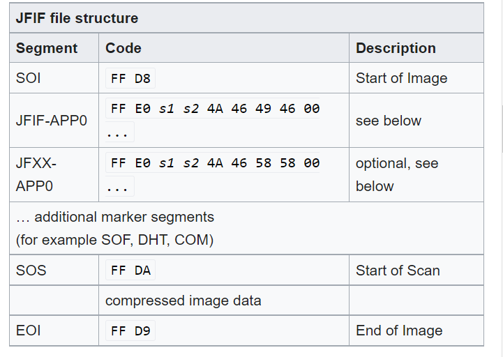
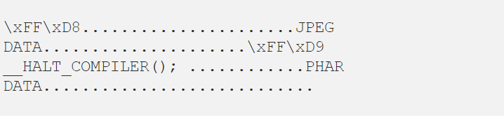

### POLYGLOT FILE LÀ MỘT FILE RẰNG NÓ SẼ HỢP LỆ VỚI NHIỀU KIỂU FILE KHÁC NHAU. Ví dụ GIFAR file này vừa là một file gif và vừa là file rar, còn nhiều trường hợp khác chẳng hạn như GIF và JS, …

- Polyglots, trong bối cảnh bảo mật, là các tệp có dạng hợp lệ của nhiều loại tệp khác nhau. Ví dụ: GIFAR vừa là tệp GIF vừa là tệp RAR. Ngoài ra còn có các tệp có thể là cả GIF và JS, cả PPT và JS, v.v.

- Các tệp Polyglot thường được sử dụng để vượt qua sự bảo vệ dựa trên loại tệp. Nhiều ứng dụng cho phép người dùng tải tệp lên chỉ cho phép tải lên một số loại nhất định, chẳng hạn như JPEG, GIF, DOC, nhằm ngăn người dùng tải lên các tệp tiềm ẩn nguy hiểm như tệp JS, tệp PHP hoặc tệp Phar.

 Một ví dụ về tệp đa ngôn ngữ là tệp Phar-JPEG. Các tệp Phar được sử dụng để thực hiện các cuộc tấn công tiêm nhiễm đối tượng PHP:

- Hiện nay việc upload một file lên một ứng dụng là một điều rất phổ biến, nhưng những ứng dụng này chỉ cho phép một vài định dạng nhất định như JPEG, GIF,PNG. Và sẽ ngăn chặn không cho người dùng upload những file có khả năng gây nguy hiểm cho ứng dụng như JS, PHP or PHAR files.

MỘT SỐ ĐỊNH DẠNG FILE QUAN TRỌNG

File Phar( PHP ARchive). Một file phar được coi là hợp lệ , Nó cần đảm bảo một cấu trúc như sau. Gồm stub section, manifest section, và content section, signature.
+) Stub section: là phần đầu tiên của file phar, phần này bắt buộc phải có __HALT_COPILER();

+) Manifest section: chứa các metadata(siêu dữ liệu) chứa thông thông tin file archive và nội dung của nó. Quan trọng là các metadata này được lưu trữ dưới dạng serialize. Khi ta sử dụng wrapper phar:// thì những metadata này sẽ tự động deserialize.( Thường dùng để khai thác lỗi deserialize)

+) Content section: là các file thực có trong archive.

+) Signature (có thể có hoặc ko): để xác thực tính toàn vẹn của file archive.

- Cách tạo một file phar:

                                        php –define phar.readonly=0 <name>.php

2) JPEG

Cấu trúc của một file JFIF:

### Vậy file polyglot làm việc như nào? Và ứng dụng sẽ xử lí file này như thế nào?

Trước tiên chúng ta phải biết cách ứng dụng phát hiện kiểu của một file nào đó như nào ?
- Có nhiều cách để làm được điều này, cách đơn giản nhất là kiểm tra file extension, hoặc có thể kiểm tra những bytes trong file (mỗi file sẽ có những bytes đặc trưng riêng của nó). Ví dụ như file JPEG bắt đầu với FF D8 và kết thúc với FF D9, file PDF bắt đầu với %PDF (hex 25 50 44 46)…

- Tạo một file polyglot (PHAR-JPEG) chúng ta có thể thấy rằng ở phần stub của file phar nó không có ràng buộc về phần nội dung ở trong phần này, ngoài việc phải có __HALT_COMPILER(); vậy ta có thêm dữ liệu vào đây để trông nó giống như một file ảnh jpeg.

- Chúng ta có thể thấy đây đã là một file jpeg hợp lệ vì nó chứa tất cả những signature của một file jpeg. Bắt đầu file là FF D8, phần header, và kết thúc là FF D9.

- Vậy nó là một file ảnh, nhưng nó cũng là một file phar, khi ta sử dụng wrapper phar://, thì phần nội dung serialized sẽ được unserilize.

