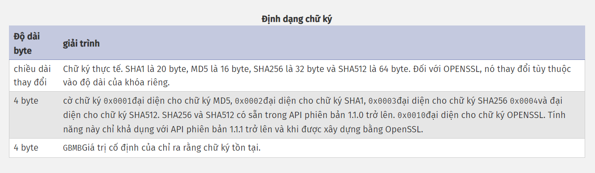

### Chữ ký
- Là một hàm băm của file archive, ta phải có chữ ký hợp lệ nếu muốn truy cập file archive từ PHP, đây là phần cuối cùng của kho lưu trữ Phar. Nó dùng để xác minh tính toàn vẹn của file Phar.

- Một Phar chứa chữ ký luôn giữ lại chữ ký. Vị trí chữ ký là phần cuối cùng của kho lưu trữ Phar, sau trình tải, bảng kê khai và nội dung tệp thực tế. Các định dạng chữ ký hiện được hỗ trợ là MD5, SHA1, SHA256, SHA512, OPENSSL.

