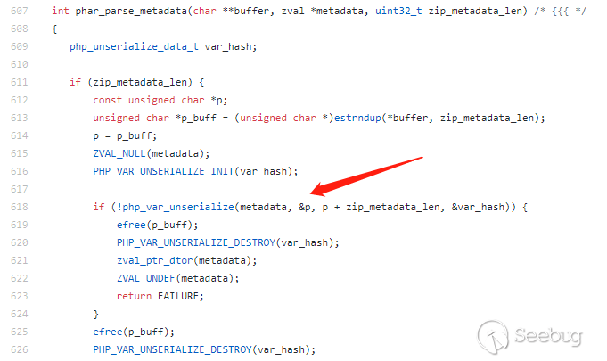
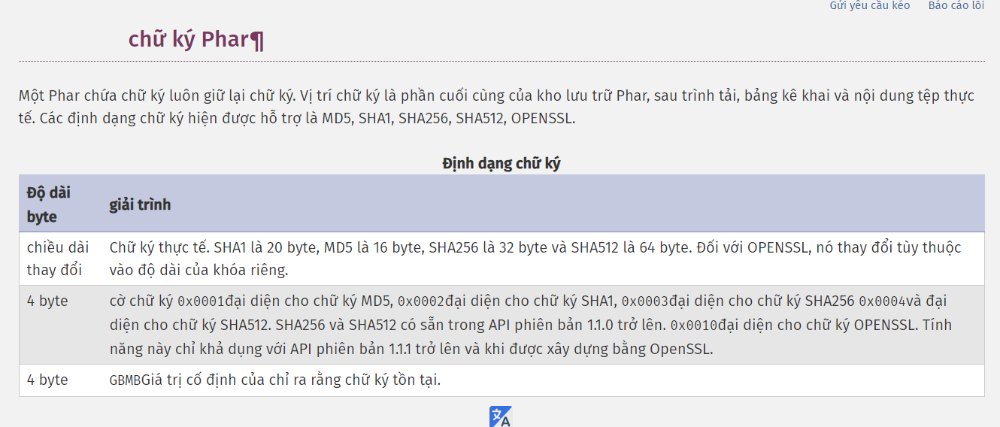
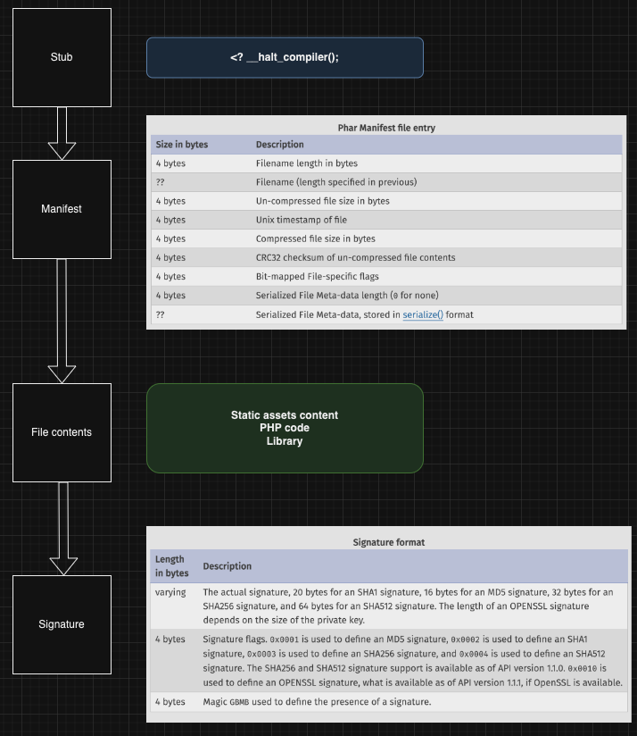
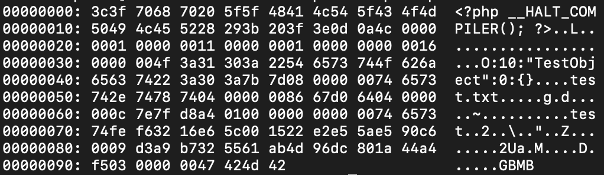

### PHP Phar

# cách hiểu thứ 1

- Giống như tệp JAR của java, ở PHP ta có thể chia sẻ thư viện hoặc toàn bộ ứng dụng dưới dạng một tệp duy nhất đó là PHAR (PHP Archive)

- Các xử lí file CỦA php cơ bản<ngôn ngữ c>

- Một file PHAR bao gồm 04 thành phần:

1. Stub
2. Manifest
3. File Contents
4. Signature

- Stub: đây là phần đầu tiên của PHAR, chứa mã nguồn chính, code gì cũng được miến cuối cùng phải có __HALT_COMPILER():

                                        <?php echo ‘STUB!’; __HALT_COMPILER(); ?>

- Manifest chứa các trường siêu dữ liệu (metadata) bao gồm thông tin về archive và các file trong archive. Điều quan trọng là các metadata này được lưu trữ dạng serialized format. Bất cứ một “hoạt động tệp” tác động đến tệp PHAR mà sử dụng wrapper phar:// thì những metadata này sẽ tự động deserialized.
                                        file_get_contents('phar://./archives/app.phar') 

- Để thêm metadata vào archive, sử dụng:

                                        PHAR: : setMetadata (mixed $metadata)

- file contents: là các file thực có trong archive, chỉ vậy

     //adds thêm file bằng $path to the archive as $name

    PHAR: : addFile (string $path, $name)

    //adds $contents to the archive as $name

    PHAR: : addFromString (string $name, string $contents)

- Signature: là một hàm băm của file archive, ta phải có chữ ký hợp lệ nếu muốn truy cập file archive từ PHP

- Cách build 01 file phar:

                                        php --define phar.readonly=0 <name>.php

# cách hiểu thứ 2
- Phar là viết tắt của PHP Archive, đây là một extension trong PHP cho phép chúng ta có thể nén toàn bộ php application vào 1 single file duy nhất, nó tương tự như tập tin .jar hay .war trong java, tất cả các resource sẽ được nén về một single file. Ở đây, để dễ hiểu hơn về khái niệm này, hãy đến với ví dụ sau: Developer có một applicaiton gồm 1 file index.php trong đó sẽ gọi đến các class nằm trong hai folder gồm /lib và /database, developer muốn nén toàn bộ application về một single file duy nhất và có thể run được application ở định dạng phar. Để có thể làm điều đó, developer sẽ tiến hành tạo một tập tin phar với nội dung sau:

$phar = new Phar('index.phar');
$phar->addFile('index.php');
$phar->buildFromDirectory('lib');
$phar->buildFromDirectory('database');

- Execute nội dung code php này, chúng ta sẽ có được tập tin index.phar là tập tin archive của toàn bộ ứng dụng và chúng ta có thể chạy lệnh `php index.phar` để chạy ứng dụng trên. Ngoài khái niệm trên, chúng ta còn một khái niệm về phar://, phar:// là một stream wrapper của PHP và được hỗ trợ từ version PHP 5.3.0 trở về sau.

- Và chúng ta đã đi qua những khái niệm đầu tiên cho challenge này, đó là PHAR. PHAR là một extension trong PHP hỗ trợ nén một php application về một single file với định dạng .phar và phar:// là một stream wrapper sẽ hỗ trợ execute các .phar file.

- PHP PHAR
- Trước khi bắt đầu tạo một file polygot, chúng ta cần tìm hiểu cấu trúc của cả hai định dạng. Về Jpeg như mình đã trình bày ở bài blog trước, mình sẽ không trình bày ở đây. Chúng ta sẽ bắt đầu tìm hiểu về cấu trúc của một tập tin phar.

- Cấu trúc của mỗi Php archive gồm 4 phần bao gồm stub, manifets , file contents và signature, nội dung signature theo document của PHP là option không phải bắt buộc của Php phar. Chúng ta sẽ chi tiết về các thành phần trong Php Archive:

+ Stubs: Là nội dung đầu tiên trong một tập tin phar. Stub chứa code PHP code sẽ được thực thi khi tập tin được truy cập. Theo đó, tập tin Phar có thể thực hiện tự giải nén thông qua Stream wrapper của PHP và stub sẽ được thực thi tại đây trong một số trường hợp. Nội dung stub cần có khai báo ít nhất gồm giá trị <? __halt_compiler();
+ Manifest: Chứa các thông tin metadata quan trọng bao gồm file size, file name hoặc cũng có thể là objects được serialized.
+ file content: Lưu trữ mọi thứ trong phar file như các static assets, code php hoặc library được nén trong tập tin phar, …
+ Signature: Là một option trong phar files, sẽ bao gồm checksums để ngăn chặn việc các corruption trong khi load file.
Chúng ta sẽ có cấu trúc một Phar file như sau:

Để dễ hiểu hơn, giả sử chúng ta có một đoạn code php để generate một tập tin phar như sau:

<?php
class TestObject {}
 
$phar = new Phar("test.phar");
$phar->startBuffering();
$phar->addFromString("test.txt","test"); // Thêm tập tin test.txt vào với nội dung là "test"
$phar->setStub("<?php __HALT_COMPILER(); ?>"); // Thêm nội dung Stub vào file
$o = new TestObject(); //Khởi tạo object
$phar->setMetadata($o); // Thêm object (metadata) vào phar
$phar->stopBuffering();

- Dưới góc độ mã hex, chúng ta sẽ có nội dung sau:

- trước tiên hãy tìm hiểu qua các function sẽ hỗ trợ stream wrapper phar://

include('phar://phar.phar/test.txt');
file_get_contents('phar://phar.phar/test.txt');
file_put_contents('phar://phar.phar/test.txt', '');
copy('phar://phar.phar/test.txt', '');
file_exists('phar://phar.phar/test.txt');
is_executable('phar://phar.phar/test.txt');
is_file('phar://phar.phar/test.txt');
is_dir('phar://phar.phar/test.txt');
is_link('phar://phar.phar/test.txt');
is_writable('phar://phar.phar/test.txt');
fileperms('phar://phar.phar/test.txt');
fileinode('phar://phar.phar/test.txt');
filesize('phar://phar.phar/test.txt');
fileowner('phar://phar.phar/test.txt');
filegroup('phar://phar.phar/test.txt');
fileatime('phar://phar.phar/test.txt');
filemtime('phar://phar.phar/test.txt');
filectime('phar://phar.phar/test.txt');
filetype('phar://phar.phar/test.txt');
getimagesize('phar://phar.phar/test.txt');
exif_read_data('phar://phar.phar/test.txt');
stat('phar://phar.phar/test.txt');
lstat('phar://phar.phar/test.txt');
touch('phar://phar.phar/test.txt');
md5_file('phar://phar.phar/test.txt');
gzfile('phar://phar.phar/test.txt');
gzopen('phar://phar.phar/test.txt','r');
readgzfile('phar://phar.phar/test.txt');
pg_trace('phar://phar.phar/test.txt');
ftp_get('phar://phar.phar/test.txt');
ftp_get($conn_id, 'phar://phar.phar/test.txt', $server_file);
ftp_nb_get($my_connection, 'phar://phar.phar/test.txt', "whatever", FTP_BINARY);
error_log('phar://phar.phar/test.txt');

- Khi các function này thực hiện load các phar file thông qua phar://, nếu tập tin phar có các khai báo các metadata thông qua setMetadata() thì chúng sẽ được deserialize và từ đây execute payload dựa trên kĩ thuật deserialization.

- Khái niệm chung, nó sẽ khai báo một object trong đó các method __destruct() hay __wakeup() được định nghĩa và control bởi attacker. Chúng sẽ thêm object này vào metadata của tập tin phar. Và khi nó phân giải, nó sẽ thực hiện deserialize dữ liệu metadata ở đây và các function __destruct() hay __wakeup() mà attacker định nghĩa sẽ được gọi.

- Như chúng ta có thể thấy, nội dung đầu tiên chính là stub sẽ bao gồm __HALT_COMPILER, vậy tại sao nó lại xuất hiện ở đây? Nó sẽ cho phép chúng ta xem phar file như là một tập tin php, và khi chúng ta thực hiện `php test.phar `chúng sẽ thực thi code ở phần stub cho đến khi gặp manifest và file contents thì sẽ dừng lại.

- Điều này có ý nghĩa gì? Nghĩa là khi execute phar file như một tập tin php thì nó đồng nghĩa với việc code php ở stub sẽ được thực thi.

- Ở đây chúng ta sẽ ví dụ đơn giản như sau, giả sử nội dung index.php có dạng:

<?php
include('phar://test.phar');
?>

https://blog.efiens.com/post/doublevkay/xxe-to-phar-deserialization/