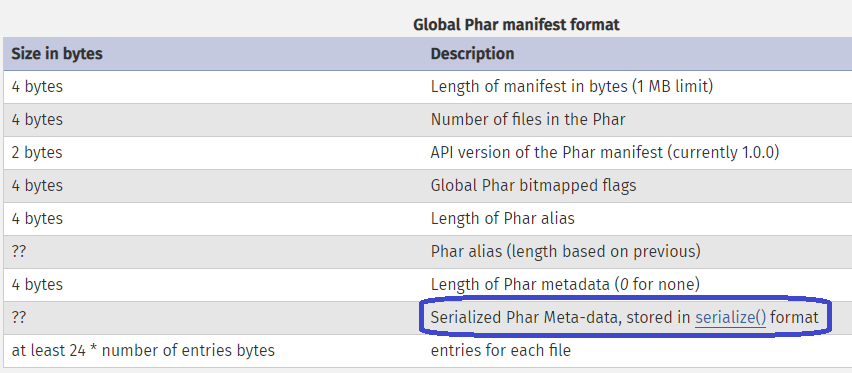
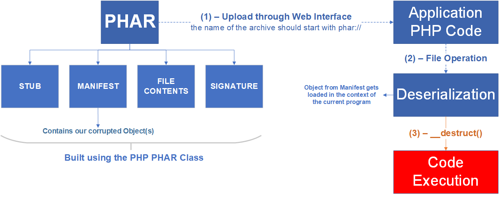

## I. Phar Deserialization là gì?

- Deserialization là một điểm yếu hot nhất của các nhà nghiên cứu bảo mật trong một thập kỷ gần đây. Mỗi năm lỗ hổng này ngày càng xảy ra nhiều hơn đối với các ngôn ngữ lập trình như Java, C# (thông qua .NET framework)

- Sam Thomas, tại Blackhat 18 tại Mẽo đã giới thiệu một cách khai thác lỗ hổng mới trong PHP. Kiểu tấn công này khai thác xoay quay 01 phương thức stream wrapper là phar://, do chúng tự động “deserialized” metadata từ tệp PHAR

- Do đó, nó mở ra các khai thác liên quan tới lập trình hướng thuộc tính bằng cách sửa đổi các thuộc tính của các object để thay đổi luồng logic của ứng dụng, mục đích cuối cùng best nhất là RCE.

## II. Phân tích PHAR archive

- Giống như tệp JAR của java, ở PHP ta có thể chia sẻ thư viện hoặc toàn bộ ứng dụng dưới dạng một tệp duy nhất đó là PHAR (PHP Archive)

- Một file PHAR bao gồm 04 thành phần:

1. Stub
2. Manifest
3. File Contents
4. Signature

- Stub: đây là phần đầu tiên của PHAR, chứa mã nguồn chính, code gì cũng được miến cuối cùng phải có __HALT_COMPILER():

                                        <?php echo ‘STUB!’; __HALT_COMPILER(); ?>

- Manifest chứa các trường siêu dữ liệu (metadata) bao gồm thông tin về archive và các file trong archive. Điều quan trọng là các metadata này được lưu trữ dạng serialized format. Bất cứ một “hoạt động tệp” tác động đến tệp PHAR mà sử dụng wrapper phar:// thì những metadata này sẽ tự động deserialized.
                                        file_get_contents('phar://./archives/app.phar') 

- Để thêm metadata vào archive, sử dụng:

                                        PHAR: : setMetadata (mixed $metadata)

- file contents: là các file thực có trong archive, chỉ vậy

     //adds thêm file bằng $path to the archive as $name

    PHAR: : addFile (string $path, $name)

    //adds $contents to the archive as $name

    PHAR: : addFromString (string $name, string $contents)

- Signature: là một hàm băm của file archive, ta phải có chữ ký hợp lệ nếu muốn truy cập file archive từ PHP

- Cách build 01 file phar:

                                        php --define phar.readonly=0 <name>.php

## III. Khai thác Phar Deserialization như nào?

- Kẻ tấn công có thể thêm object từ bất kỳ class vào metadata của PHAR. Khi file PHAR được kích hoạt bên trong code PHP, tiến trình “deserialization” của PHAR cũng được kích hoạt.

- Chương trình sẽ load các object đã được định trước trong metadata của PHAR (nếu nó thuộc về một class có trong code PHP). Ở PHP người ta có một số method mà khi có một sự kiện nhất định sẽ được gọi, người ta gọi là magic method, trong chủ đề này ta chỉ quan tâm 02 thằng magic method là __wakeup() và __destruct(), vì chúng được gọi khi một object cần unserialized hoặc destroyed. Hãy tập trung vào __destruct() vì rất có thể nó đã được định nghĩa trong code PHP của ứng dụng mục tiêu rồi.

- Dưới đây là một ví dụ về luồng để giúp bạn hình dung một cuộc tấn công Phar Deserialization như thế nào:

- Đầu tiên là ta sẽ build file PHAR sử dụng PHP PHAR class
- Tiếp theo sẽ upload file lên sever
- Tên của archiver cần phải bắt đầu bằng wrapper phar:// 
- Sau đó sẽ được file operator deserialized bằng việc load các Oblject có trong trường mainfest của file phar vào trong chương trình hiện tại 
- Cuối cùng lợi dụng các magic method để thực hiện các vụ không mong muốn.

## IV. Khai thác Phar Deserialization trong thực tế (hoặc CTF)

## 6. Biện pháp giảm thiểu chính để tránh lỗ hổng khử tuần tự PHAR
Mặc dù quen thuộc với cộng đồng bảo mật, cuộc tấn công này vẫn nằm trong tầm ngắm của hầu hết các nhà phát triển web và do đó, tiềm ẩn rủi ro.

Biện pháp đối phó đầu tiên và quan trọng nhất mà các nhà phát triển nên thực hiện là  vệ sinh cẩn thận đầu vào của người dùng . Trong trường hợp này, hãy kiểm tra kỹ lưỡng loại tệp nào người dùng có thể tải lên và cũng áp dụng một số ngẫu nhiên cho tên tệp khi được lưu trữ phía máy chủ.

Quá trình khử lưu huỳnh PHAR cung cấp cho kẻ tấn công một kỹ thuật mới để khai thác các ứng dụng web. Rủi ro kinh doanh rất cao  vì việc khai thác thành công có thể dẫn đến việc thực thi mã trên máy chủ Một khi kẻ tấn công giành được chỗ đứng trên máy chủ của bạn, trí tưởng tượng của chúng là giới hạn duy nhất.

## Tham khảo thêm tại:
https://i.blackhat.com/us-18/Thu-August-9/us-18-Thomas-Its-A-PHP-Unserialization-Vulnerability-Jim-But-Not-As-We-Know-It-wp.pdf
https://www.zerodayinitiative.com/blog/2019/4/11/a-series-of-unfortunate-images-drupal-1-click-to-rce-exploit-chain-detailed