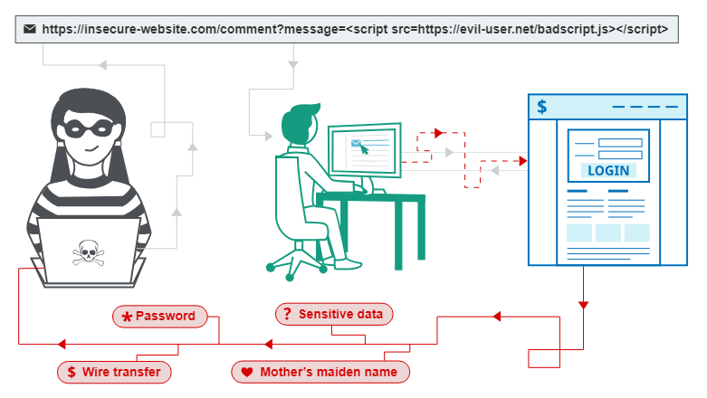

### Cross-site scripting

# Khái niệm
- Tập lệnh chéo trang (còn được gọi là XSS) là một lỗ hổng bảo mật web cho phép kẻ tấn công xâm phạm các tương tác mà người dùng thực hiện với một ứng dụng dễ bị tấn công. Nó cho phép kẻ tấn công phá vỡ chính sách xuất xứ tương tự, được thiết kế để tách biệt các trang web khác nhau với nhau. Các lỗ hổng kịch bản chéo trang thường cho phép kẻ tấn công giả dạng người dùng nạn nhân, thực hiện bất kỳ hành động nào mà người dùng có thể thực hiện và truy cập bất kỳ dữ liệu nào của người dùng. Nếu người dùng nạn nhân có quyền truy cập đặc quyền vào ứng dụng thì kẻ tấn công có thể giành được toàn quyền kiểm soát tất cả chức năng và dữ liệu của ứng dụng.

# Flow
- XSS hoạt động theo cách trả về tập lệnh javascript không mong muốn cho người dùng và lúc này thông tin của người dùng như cookie,.. sẽ bị đánh cắp thông qua mã js này và tập lệnh này phải tự động thực hiện khi người dùng try cập vào nó.

- Ví dụ như ở này khi victim truy cập trang web đã dính lỗi XSS để đăng nhập vào tài khoản ngân hàng khi submit sẽ gửi toàn bộ thông tin này cho kẻ tấn công, vì vậy một số ngân hàng hình như là hầu hết sẽ có cơ chế bảo mật 2 lớp khi đăng nhập tài khoản bằng máy lạ

- Tấn công Cross Site Scripting nghĩa là gửi và chèn lệnh và script độc hại, những mã độc này thường được viết với ngôn ngữ lập trình phía client như Javascript, HTML, VBScript, Flash… Tuy nhiên, cách tấn công này thông thường sử dụng Javascript và HTML. Cách tấn công này có thể được thực hiện theo nhiều cách khác nhau, phụ thuộc vào loại tấn công XSS, những mã độc có thể được phản chiếu trên trình duyệt của nạn nhân hoặc được lưu trữ trong cơ sở dữ liệu và được chạy mỗi khi người dùng gọi chức năng thích hợp. Nguyên nhân chính của loại tấn công này là xác thực đầu vào dữ liệu người dùng không phù hợp, dữ liệu độc hại từ đầu vào có thể xâm nhập vào dữ liệu đầu ra. Mã độc có thể nhập một script và được chèn vào mã nguồn của website. Khi đó trình duyệt không thể biết mã thực thi có phải độc hại hay không. Do đó mã độc hại có thể đang được thực thi trên trình duyệt của nạn nhận hoặc bất kỳ hình thức giả nào đang được hiển thị cho người sử dụng. Có một số hình thức tấn công XSS có thể xảy ra. Bên dưới là những hình thức tấn công chính của Cross Site Scripting:

+ Cross Site Scripting có thể xảy ra trên tập lệnh độc hại được thực hiện ở phía client.
+ Trang web hoặc form giả mạo được hiển thị cho người dùng (nơi nạn nhân nhập thông tin đăng nhập hoặc nhấp vào liên kết độc hại).
+ Trên các trang web có quảng cáo được hiển thị.
+ Email độc hại được gửi đến nạn nhân. Tấn công xảy ra khi tin tặc tìm kiếm những lỗ hổng trên website và gửi nó làm đầu vào độc hại. Tập 
lệnh độc hại được tiêm vào mã lệnh và sau đó được gửi dưới dạng đầu ra cho người dùng cuối cùng.

# XSS được sử dụng
+ Mạo danh hoặc giả dạng người dùng nạn nhân.
+ Thực hiện bất kỳ hành động nào mà người dùng có thể thực hiện.
+ Đọc bất kỳ dữ liệu nào mà người dùng có thể truy cập.
+ Nắm bắt thông tin đăng nhập của người dùng.
+ Thực hiện deface ảo của trang web.
+ Đưa chức năng trojan vào trang web.

# Tác động
+ Tác động của lỗ hổng XSS
+ Tác động thực tế của cuộc tấn công XSS thường phụ thuộc vào bản chất của ứng dụng, chức năng và dữ liệu của ứng dụng cũng như trạng thái của người dùng bị xâm nhập. Ví dụ:

+ Trong một ứng dụng phần mềm quảng cáo, nơi tất cả người dùng đều ẩn danh và tất cả thông tin đều được công khai, tác động thường sẽ rất nhỏ.
+ Trong một ứng dụng chứa dữ liệu nhạy cảm, chẳng hạn như giao dịch ngân hàng, email hoặc hồ sơ chăm sóc sức khỏe, tác động thường sẽ nghiêm trọng.
+ Nếu người dùng bị xâm nhập có đặc quyền nâng cao trong ứng dụng thì tác động nhìn chung sẽ rất nghiêm trọng, cho phép kẻ tấn công có toàn quyền kiểm soát ứng dụng dễ bị tấn công và xâm phạm tất cả người dùng cũng như dữ liệu của họ.

# Cách kiểm thử
- Trước tiên, để kiểm thử tấn công XSS, kiểm thử hộp đen có thể được thực hiện. Nó có nghĩa là, chúng ta có thể test mà không cần xem xét code. Tuy nhiên, xem xét code luôn là một việc nên làm và nó mang lại kết quả đáng tin cậy.
-  xem xét phần nào của website là có thể bị tấn công XSS. Tốt hơn là liệt kê chúng trong tài liệu kiểm thử và bằng cách này, bảo đảm chúng ta sẽ không bị bỏ xót. Sau đó, tester nên lập kế hoạch cho các script nào phải được kiểm tra. xem xét phần nào của website là có thể bị tấn công XSS. Tốt hơn là liệt kê chúng trong tài liệu kiểm thử và bằng cách này, bảo đảm chúng ta sẽ không bị bỏ xót. Sau đó, tester nên lập kế hoạch cho các script nào phải được kiểm tra.

# Ngăn chặn
- Các phương pháp phòng ngừa chính được sử dụng phổ biến bao gồm:

+ Data validation 
+ Filtering
+ Escaping
- Nói chung là mình phải kiểm tra Sink của code có thể gây ra XSS được không bằng cách validate dữ liệu filter đầu vào,..