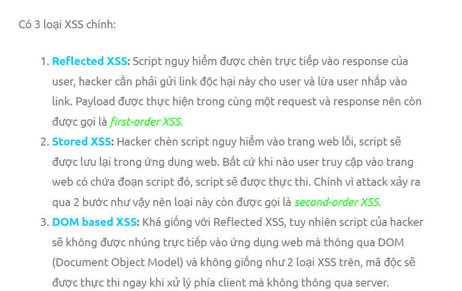
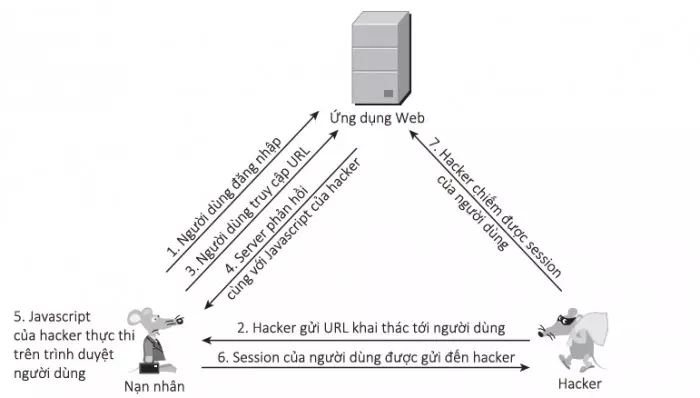
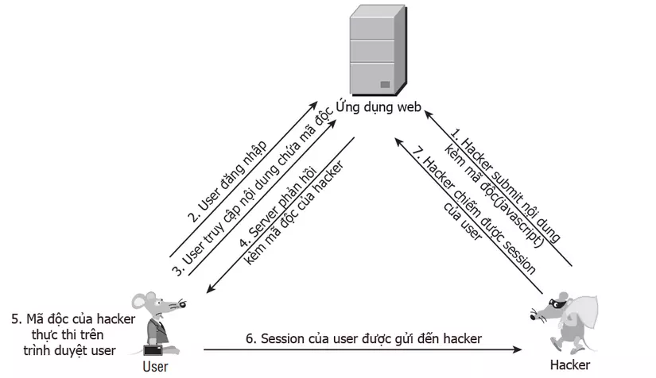
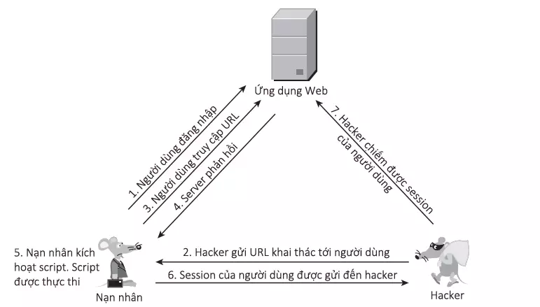

### Các loại tấn công XSS

# Phân loại:

- Có ba loại tấn công XSS chính. Đó là:
+ Reflected XSS : trong đó tập lệnh độc hại xuất phát từ yêu cầu HTTP hiện tại.
+ Stored XSS : nơi tập lệnh độc hại đến từ cơ sở dữ liệu của trang web.
+ DOM-based XSS : trong đó lỗ hổng tồn tại trong mã phía máy khách chứ không phải mã phía máy chủ.

# Reflected XSS
- Reflected XSS là loại kịch bản chéo trang đơn giản nhất. Nó phát sinh khi một ứng dụng nhận được dữ liệu trong một yêu cầu HTTP và bao gồm dữ liệu đó trong phản hồi ngay lập tức theo cách không an toàn.

- Nếu người dùng truy cập URL do kẻ tấn công tạo thì tập lệnh của kẻ tấn công sẽ thực thi trong trình duyệt của người dùng, trong bối cảnh phiên của người dùng đó với ứng dụng. Tại thời điểm đó, tập lệnh có thể thực hiện bất kỳ hành động nào và truy xuất bất kỳ dữ liệu nào mà người dùng có quyền truy cập.

- Có nhiều hướng để khai thác thông qua lỗi Reflected XSS, một trong những cách được biết đến nhiều nhất là chiếm phiên làm việc (session) của người dùng, từ đó có thể truy cập được dữ liệu và chiếm được quyền của họ trên website.

- FLOW

- DEMO : 

# Stored XSS
- Stored XSS (còn được gọi là XSS liên tục hoặc XSS thứ hai) phát sinh khi một ứng dụng nhận dữ liệu từ một nguồn không đáng tin cậy và đưa dữ liệu đó vào các phản hồi HTTP sau này theo cách không an toàn.

- Khác với Reflected tấn công trực tiếp vào một số nạn nhân mà hacker nhắm đến, Stored XSS hướng đến nhiều nạn nhân hơn. Lỗi này xảy ra khi ứng dụng web không kiểm tra kỹ các dữ liệu đầu vào trước khi lưu vào cơ sở dữ liệu (ở đây tôi dùng khái niệm này để chỉ database, file hay những khu vực khác nhằm lưu trữ dữ liệu của ứng dụng web). Ví dụ như các form góp ý, các comment … trên các trang web. Với kỹ thuật Stored XSS , hacker không khai thác trực tiếp mà phải thực hiện tối thiểu qua 2 bước.

+ Đầu tiên hacker sẽ thông qua các điểm đầu vào (form, input, textarea…) không được kiểm tra kỹ để chèn vào CSDL các đoạn mã nguy hiểm.
+ Tiếp theo, khi người dùng truy cập vào ứng dụng web và thực hiện các thao tác liên quan đến dữ liệu được lưu này, đoạn mã của hacker sẽ được thực thi trên trình duyệt người dùng.

- FLOW

-DEMO : 

#  DOM Based XSS
- XSS dựa trên DOM (còn được gọi là DOM Based XSS ) phát sinh khi một ứng dụng chứa một số JavaScript phía máy khách xử lý dữ liệu từ nguồn không đáng tin cậy theo cách không an toàn, thường bằng cách ghi dữ liệu trở lại DOM, là kỹ thuật khai thác XSS dựa trên việc thay đổi cấu trúc DOM của tài liệu, cụ thể là HTML.

- FLOW:

- DEMO :