### What is XSS Auditor?

- XSS ngày càng trở nên phổ biến, hậu quả mà nó mang lại cũng khôn lường. XSS xuất hiện khắp nơi trên các ứng dụng web. Việc xây dựng một trang web không có lỗi XSS không hề dễ dàng. Đội ngũ bảo mật của các trình duyệt web biết điều đó, nên họ đã giúp cho cuộc sống của dev dễ thể hơn bằng cách phát triển các bộ lọc giúp tự động phát hiện và ngăn chặn XSS.

- Internet Explore giới thiệu tính năng XSS Filter, Google Chrome không kém cạnh khi phát triển XSS Auditor, cả 2 đều được bật mặc định trên browser. Ông lớn Firefox với lợi thế mã nguồn mở thì có addon NoScript với chức năng tương tự.

- XSS Filter và XSS Auditor có cơ chế hoạt động khá tương đồng, và đều có thể được bật qua HTTP Header X-XSS-Protection.

# Trong bài báo mà đội ngũ phát triển của Google Chrome công bố, họ cho rằng XSS Auditor tốt hơn bộ lọc của các Browser khác vì 2 lý do: nhanh hơn, bảo mật hơn. :3

- Về cơ bản, browser sẽ scan tất cả các tham số trong request, nhận ra đoạn script nguy hiểm và so sánh nó với response từ server. Nếu đoạn script này xuất hiện trong response, browser sẽ nhận biết đó là một cuộc tấn công XSS và sẽ hoặc là lọc bỏ, hoặc là block luôn.

- Cách thức hoạt động của XSS Auditor như vậy chỉ ngăn chặn được Reflected XSS vì mã độc được reflect trực tiếp vào response, nó hoàn toàn không được thiết kế để ngăn chặn Stored XSS và DOM based XSS.

- XSS Auditor được bật mặc định, hoặc bạn có thể tùy chỉnh cấu hình nó thông qua HTTP Header X-XSS-Protection.

- X-XSS-Protection có 3 chế độ:

+ X-XSS-Protection: 0: tắt bộ lọc
+ X-XSS-Protection: 1: bật bộ lọc ở chế độ filter, browser chỉ lọc mã độc, không block response từ server.
+ X-XSS-Protection: 1; mode=block: bật bộc lọc ở chế độ block, nếu phát hiện mã độc browser sẽ block luôn response và trả về trang thông báo lỗi.

# X-XSS-Protection: 0
- Trường hợp này thì không sử dụng filter gì và xác định gì ạ nên XSS bình thường ạ.
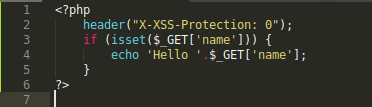
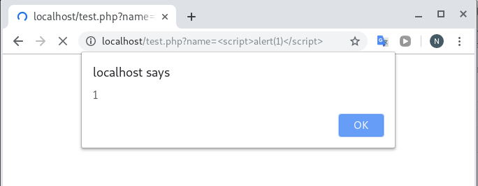

# X-XSS-Protection: 1
- bật bộ lọc ở chế độ filter, browser chỉ lọc mã độc, không block response từ server.
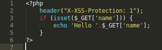
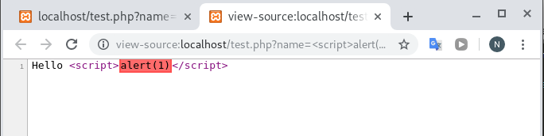

# X-XSS-Protection: 1; mode=block
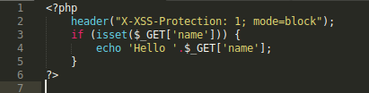
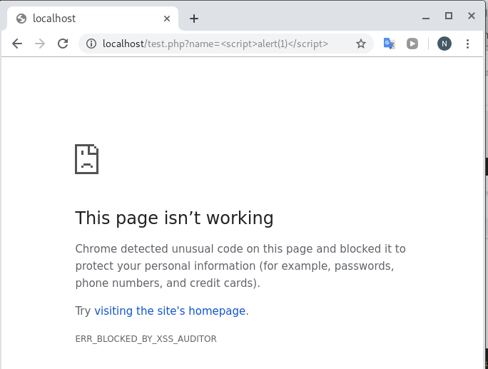

- XSS Auditor quả thực đã giúp ngăn chặn rất nhiều cuộc tấn công Reflected XSS từ trong trứng nước.

Một số cách bypassing:

1. Multi Reflection XSS
- Multi Reflection XSS xảy ra khi input không được validate của user xuất hiện nhiều hơn 1 vị trí trong response, hay nói cách khác trang web bị lỗi XSS ở nhiều vị trí. Lúc này, XSS Auditor sẽ dễ dàng bị bypass.

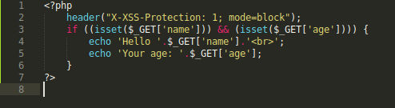
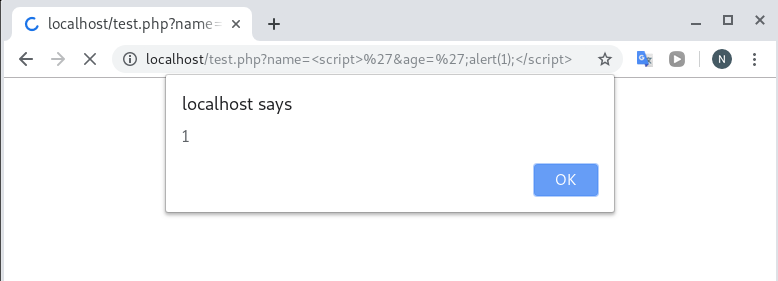

- Ứng dụng có 2 chỗ bị XSS: tham số name và age. Xem response từ server sẽ hiểu ngay cách mà payload hoạt động. XSS Auditor chỉ scan mỗi tham số một cách riêng lẻ nên khi ta chia payload ra thành 2 phần, mỗi phần nhỏ đều không thể là mã độc, nên XSS Auditor sẽ không block nó. Thế nhưng khi kết hợp 2 phần lại thì 
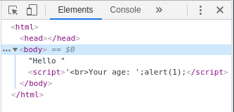

2. Multi Reflection – single input
- Ở đây, cùng một input được render vào 2 vị trí khác nhau trong trang web.
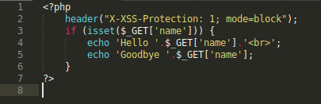
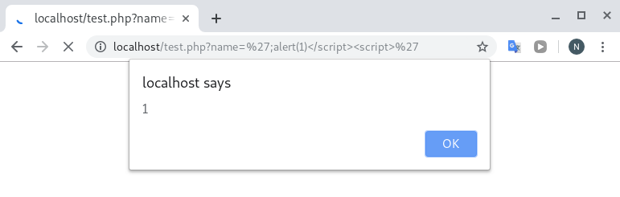

Nguồn : NhatTruongBlog ạ:3