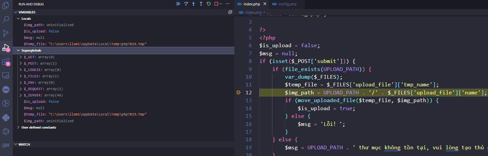
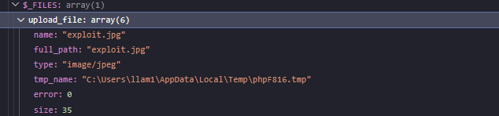

Sau khi em upload 1 file ở ví dụ này thì em đã upload 1 file jpg sau khi em debug bằng XDebug các thuộc tính của $_FILE em nhận được kết quả như sau:

- Quan sát kĩ hơn em thấy có các thuộc tính như này ạ

array (size=1)
  'upload_file' => 
    array (size=6)
      'name' => string 'exploit.jpg' (length=11)
      'full_path' => string 'exploit.jpg' (length=11)
      'type' => string 'image/jpeg' (length=10)
      'tmp_name' => string 'C:\Users\llam1\AppData\Local\Temp\phpF816.tmp' (length=45)
      'error' => int 0
      'size' => int 35

- name: Tên của tệp đã được tải lên, trong trường hợp này là "exploit.jpg".
- full_path: Đường dẫn đầy đủ của tệp đã tải lên, trong trường hợp này cũng là "exploit.jpg".
- type: Loại của tệp, ở đây là "image/jpeg" cho biết đây là một tệp hình ảnh JPEG.
- tmp_name: Đường dẫn tạm thời của tệp tải lên trong máy chủ, trong trường hợp này là "C:\Users\llam1\AppData\Local\Temp\phpF816.tmp".
- error: Mã lỗi liên quan đến quá trình tải lên, trong trường hợp này là 0, cho biết không có lỗi xảy ra.
- size: Kích thước của tệp tải lên, ở đây là 35 byte.