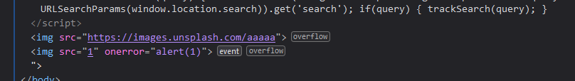
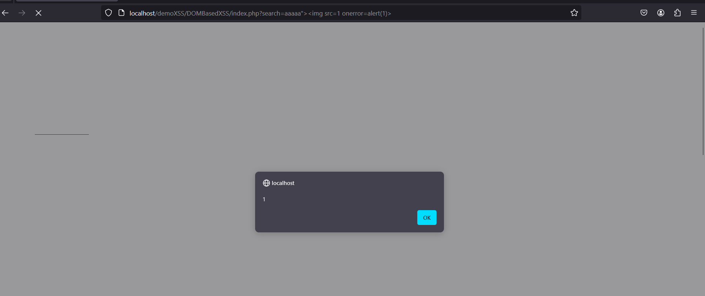
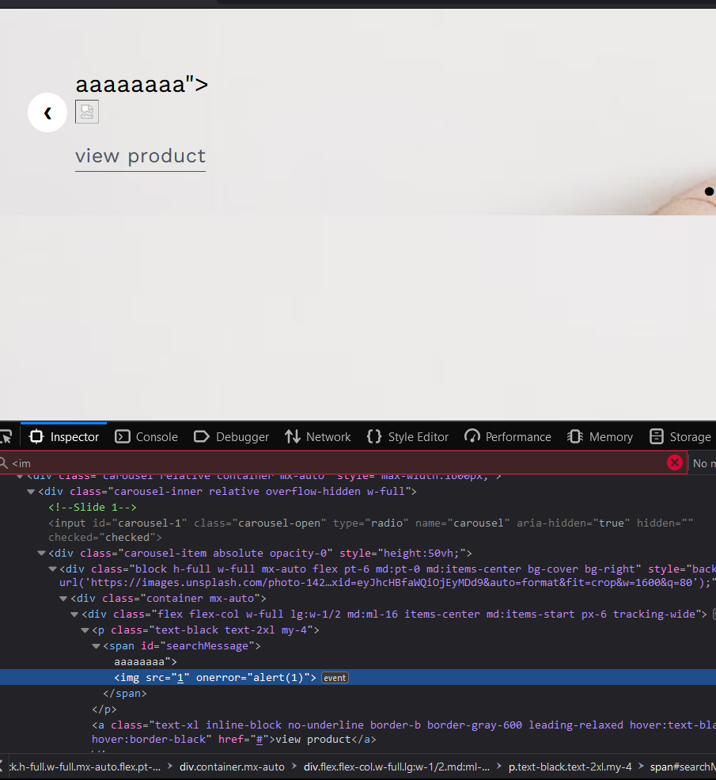

- Trang web cho chức năng show và tìm sản phẩn trong ô search

## VỚI document.write()

- Hàm dính lỗi DOM based XSS

- khi submit form get khi search nếu thì sẽ hiển thị hết quả với ảnh bằng lệnh document.write
 <form action="index.php" method="get" class="flex items-center" id="store-nav-content">

                        <input type="text" class="p-4 bg-gray-200 rounded-xl" name = "search" placeholder="Search for items"/>

                        <button type="submit" class="pl-3 inline-block no-underline hover:text-black">
                            <svg class="fill-current hover:text-black" xmlns="http://www.w3.org/2000/svg" width="24" height="24" viewBox="0 0 24 24">
                                <path d="M10,18c1.846,0,3.543-0.635,4.897-1.688l4.396,4.396l1.414-1.414l-4.396-4.396C17.365,13.543,18,11.846,18,10 c0-4.411-3.589-8-8-8s-8,3.589-8,8S5.589,18,10,18z M10,4c3.309,0,6,2.691,6,6s-2.691,6-6,6s-6-2.691-6-6S6.691,4,10,4z" />
                            </svg>
                        </button>

                    </form>

- Em sẽ lợi dụng giá trị này để tạo cuộc tấn công DOM based XSS
payload:                              aaaaa">

- Lúc này khi document.write sẽ tạo ra:   

- Kết quả em nhận được là
 

## Với innerHTML

- Tương tự như trường hợp trên nhưng mà trường hợp này sử dụng inner HTML để hiển thị nội dung

- và thẻ  khi thực hiện tìm kiếm thì sẽ lấy giá trị tìm kiếm hiển thị ra

payload : aaaaa thì được kết quả

- Và chúng ta đã XSS thành công ạ