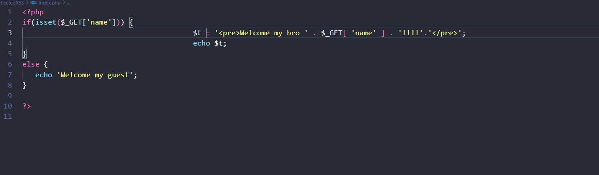
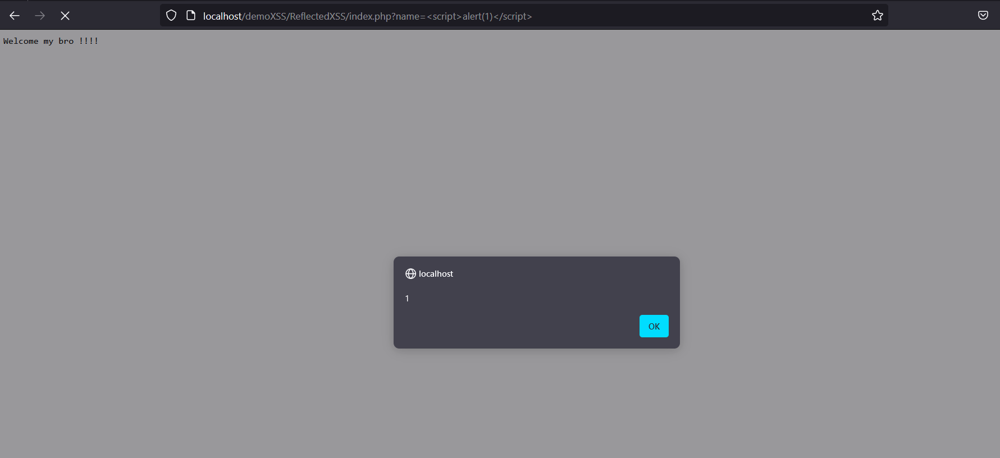
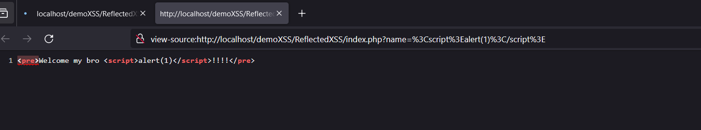
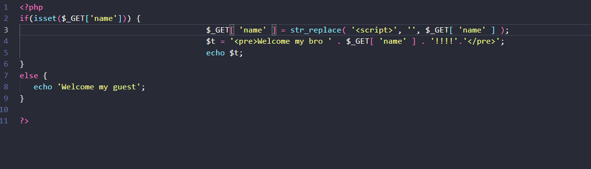
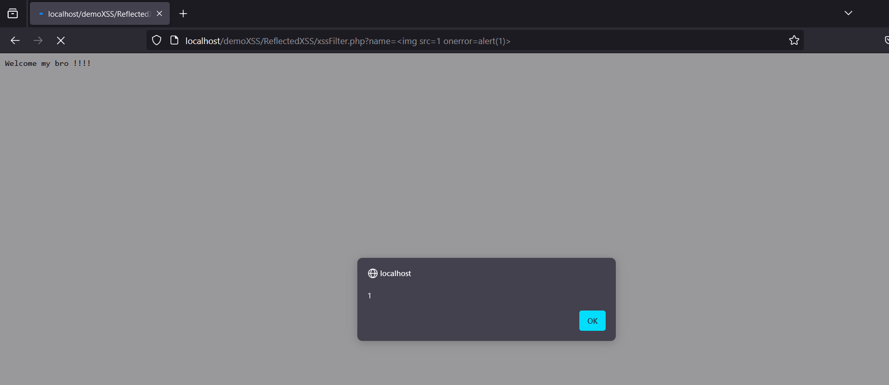
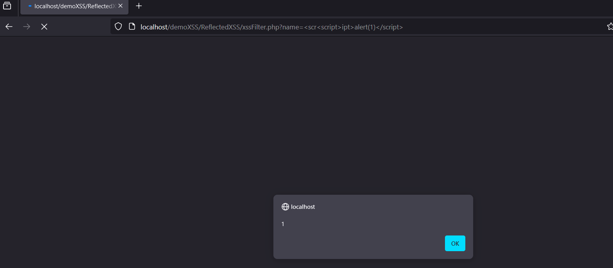

- Đây là một bài XSS cơ bản là reflectXSS ạ.

# Cấp độ 1:

- Không filter gì ạ:<

- Bài này khi mà check nếu param name có giá trị sẽ in ra lời chào với tên nếu không có thì chào guest , ta có thể thấy dòng này dính lỗi XSS cơ bản
và em dùng  để tạo ra 1 script

# Cấp độ 2 : có filter

- Bài này khi mà phát hiện thấy đầu vào có thẻ  vì sau khi thay thế sẽ trở thành 

Kết quả: 

- Trong này cũng có source của các trường hợp hay gặp ạ: https://github.com/l3mnt2010/task3_KCSC/blob/main/Filter%20v%C3%A0%20bypass%20XSS.md

