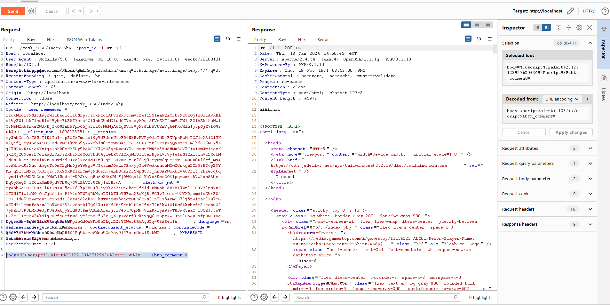
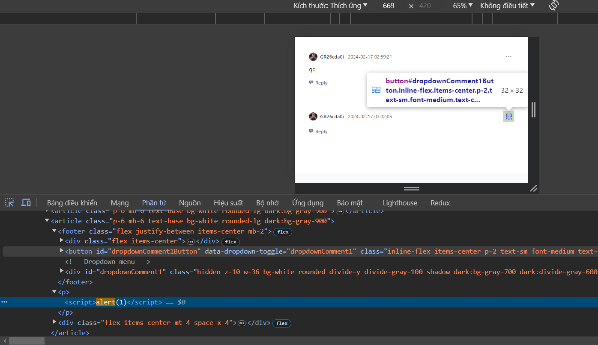
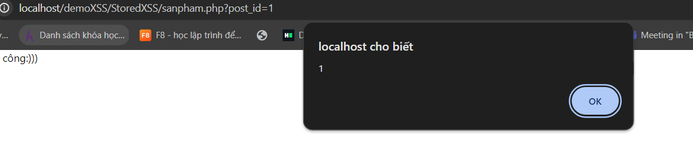
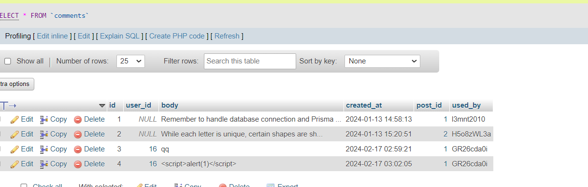
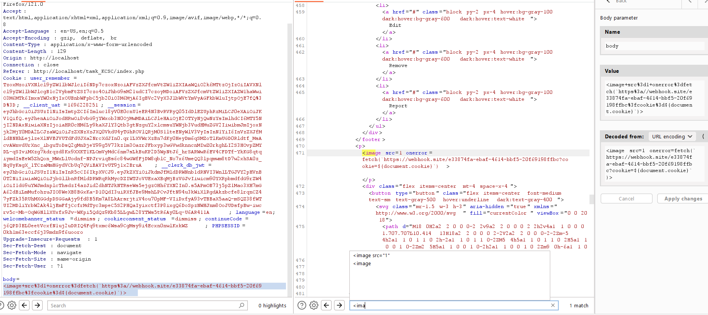
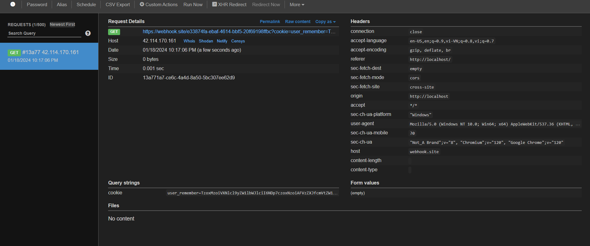

## Trang web có chức năng đăng kí đăng nhập, xem hàng và bình luận ở mỗi sản phẩm

- ở chức năng bình luận không bị filter đầu vào và lưu vào database cho nên em sử dụng 

- em sẽ comment vào sản phẩm này là 

sau đó em nhận được Comment của em hiển thị với chức năng như 1 thẻ <script> trong page

- Và khi đó bất kì người dùng nào vào đọc sản phẩm này của em đều sẽ bị dính phải 

- Và đây là lỗ hổng store XSS vì em có lưu nội dung của comment trong database.

- ở đây em sẽ dùng webhook

-Và sau khi load ảnh error thì sẽ gửi request đến webhook kèm cookie của nạn nhận với bất kì người dùng nào truy cập trang này

- vậy là em đã khai thác thành công lỗ hổng store XSS ạ.