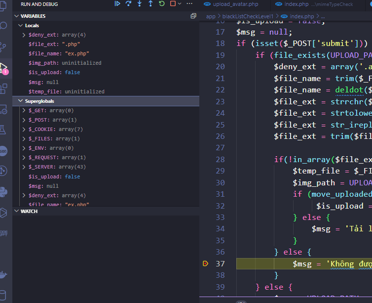
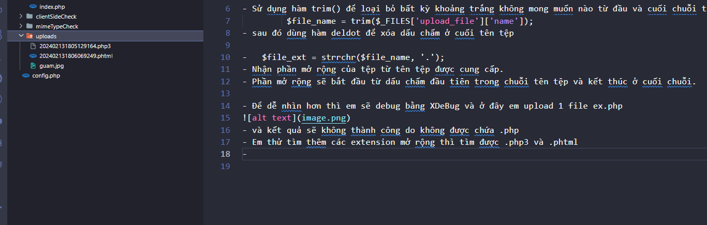
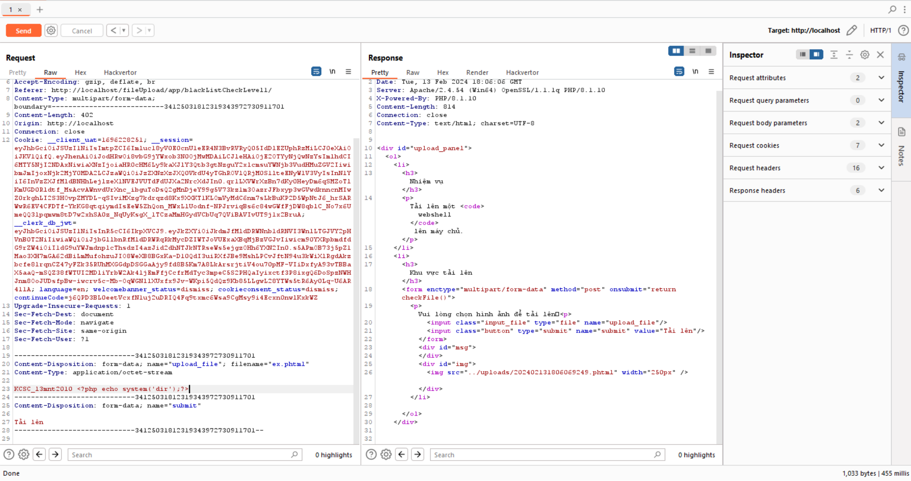
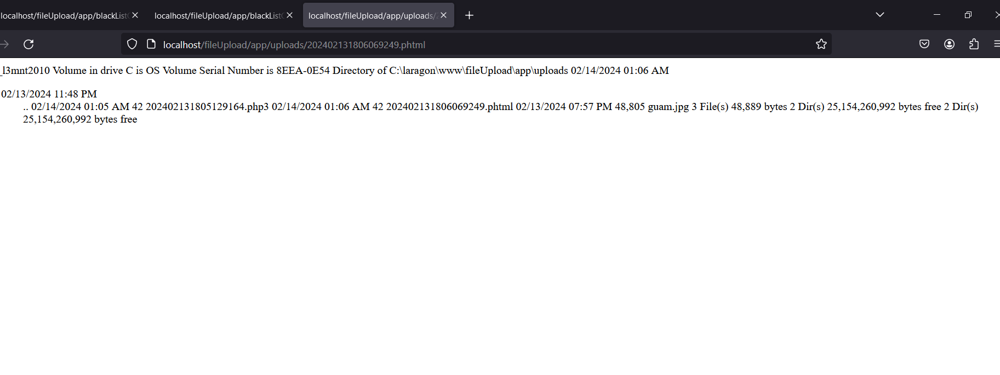
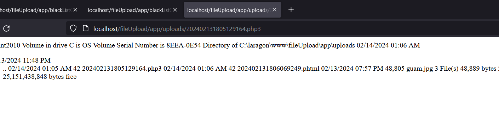

## Bài này thực hiện check khá nghiêm ngặt ạ

- đầu tiên có một list danh sách sau khi qua filter thì check sẽ tên extension có trong list không nếu có thì không được up
            $deny_ext = array('.asp','.aspx','.php','.jsp');

- Sử dụng hàm trim() để loại bỏ bất kỳ khoảng trắng không mong muốn nào từ đầu và cuối chuỗi tên tệp.
         $file_name = trim($_FILES['upload_file']['name']);
- sau đó dùng hàm deldot để xóa dấu chấm ở cuối tên tệp

-   $file_ext = strrchr($file_name, '.'); 
- Nhận phần mở rộng của tệp từ tên tệp được cung cấp.
- Phần mở rộng sẽ bắt đầu từ dấu chấm đầu tiên trong chuỗi tên tệp và kết thúc ở cuối chuỗi.

- Để dễ nhìn hơn thì em sẽ debug bằng XDeBug và ở đây em upload 1 file ex.php

- và kết quả sẽ không thành công do không được chứa .php
- Em thử tìm thêm các extension mở rộng thì tìm được .php3 và .phtml và em upload .phtml thì được

- Mở file ra và RCE được ạ

- Tương tự với .php3 ạ
