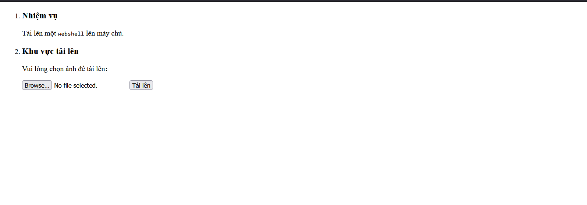
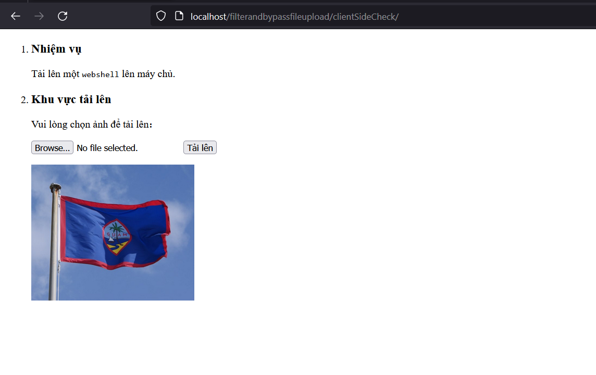
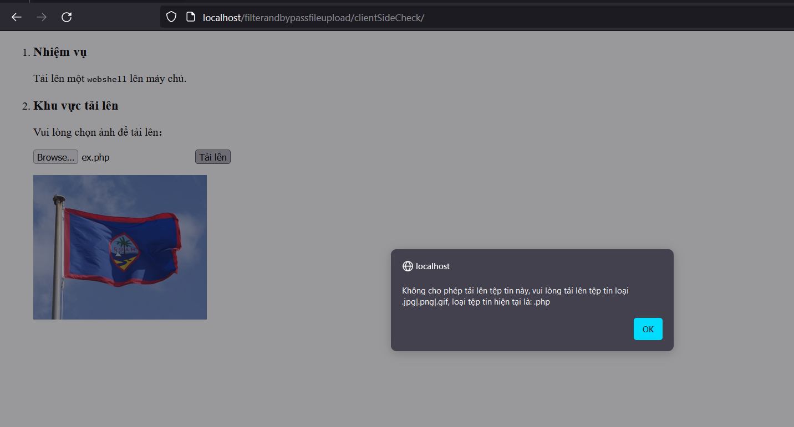
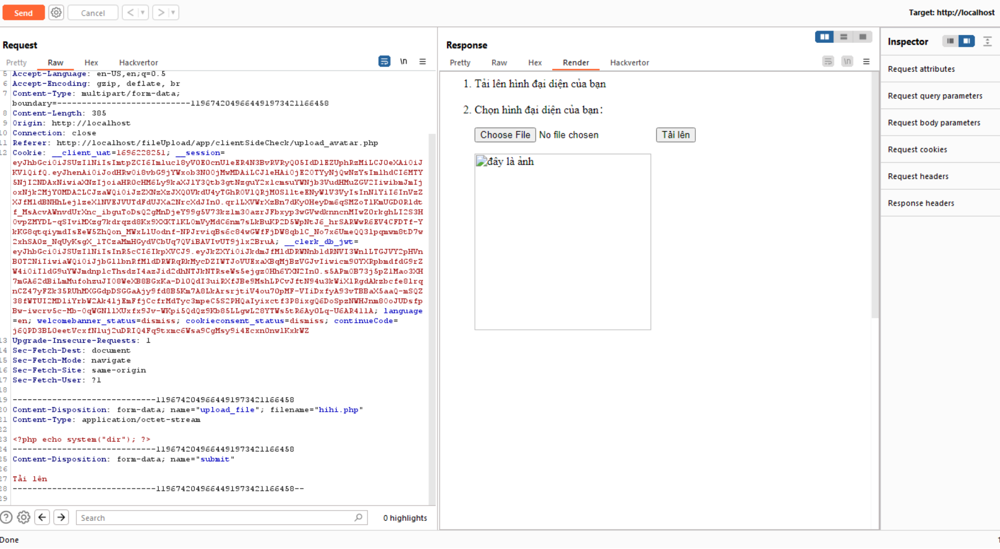
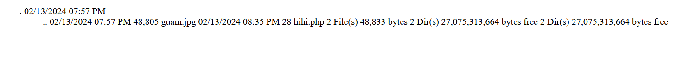

### Bài này sẽ thực hiện check file ở client

var allow_ext = ".jpg|.png|.gif";

- sẽ cho phép tải lên file có phần mở rộng là jpg, png và gif.
- Một cách để bypass việc check này là ta sẽ sử dụng burpsuite để sửa lại thông tin của file



- Em sẽ thử việc upload một file jpg


- và thành công
- Bây giờ em thử upload 1 file php


- khi tải lên sẽ gọi hàm checkFile nên nếu em tải lên file php thì sẽ không được phép

```
 function checkFile() {
        var file = document.getElementsByName('upload_file')[0].value;
        if (file == null || file == "") {
            alert("Vui lòng chọn tệp tin để tải lên!");
            return false;
        }
        var allow_ext = ".jpg|.png|.gif";
        var ext_name = file.substring(file.lastIndexOf("."));
        if (allow_ext.indexOf(ext_name) == -1) {
            var errMsg = "Không cho phép tải lên tệp tin này, vui lòng tải lên tệp tin loại " + allow_ext + ", loại tệp tin hiện tại là: " + ext_name;
            alert(errMsg);
            return false;
        }
    }

```
- Em sẽ dùng burp-suite để tải lên file


- Em mở file ra và nhận được kết quả
