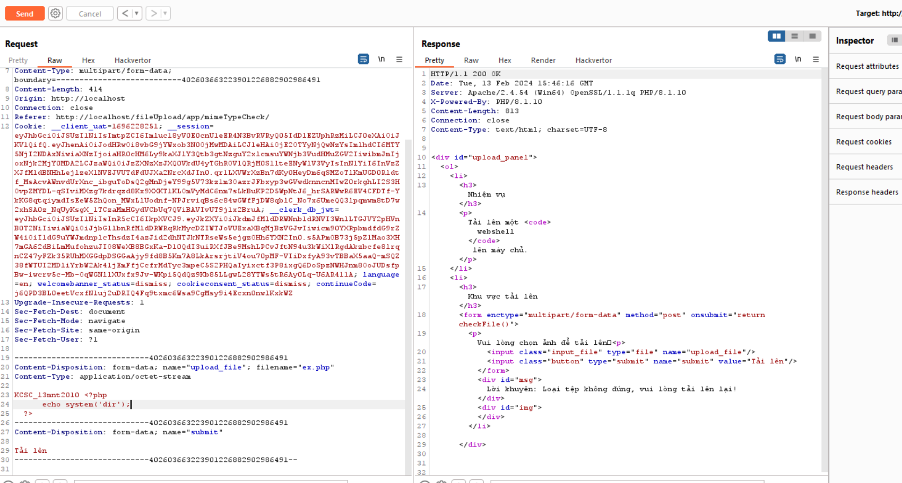
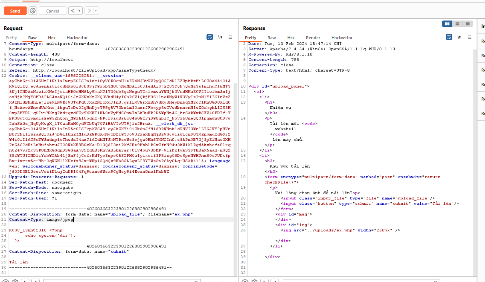

## Bài này thực hiện check MIMEType của tệp bằng dòng lệnh:

        if (($_FILES['upload_file']['type'] == 'image/jpeg') || ($_FILES['upload_file']['type'] == 'image/png') || 
        ($_FILES['upload_file']['type'] == 'image/gif'))
- Em thử upload file php để check thử

- Em đổi content type thành image/jpeg và đã thành công

- Em mở file ra và nhận được kết quả ạ
